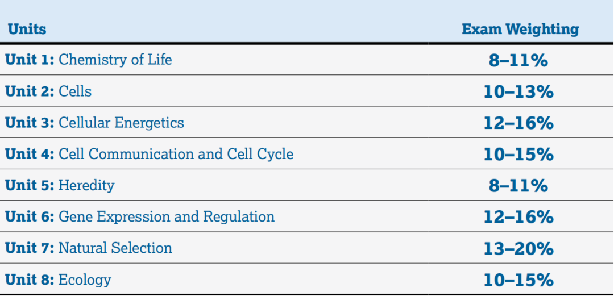

# What’s New in the 2026 AP Biology Exam? A Comprehensive Guide to the Updated Curriculum

The College Board has officially rolled out a major update to the **AP Biology curriculum**, the first significant revision since 2020. Set to take full effect for the **2026 exam administration**, these changes reflect a clear shift in emphasis: **from rote memorization to scientific reasoning, data analysis, and interdisciplinary application**.

For students aiming for that coveted 5, especially those targeting competitive STEM, pre-med, or biomedical engineering pathways, understanding these updates is essential. With a historically low 5-rate of just **7%**, AP Biology remains one of the most challenging AP science exams. But with the right strategy, it can also be one of the most rewarding.

Let’s break down what’s changed, unit by unit, and what it means for your preparation.

## Big-Picture Shifts in the 2025–2026 AP Biology Exam

Before diving into the units, note these overarching trends:

- **Greater emphasis on data interpretation**: Expect more questions that require you to analyze graphs, tables, and experimental results—often spanning multiple units.
- **Increased focus on scientific practices**: You’ll need to **explain, predict, and justify**—not just recall facts.
- **Explicit graphing requirements**: The new course framework now **explicitly requires students to draw labeled, scaled graphs with proper units** in FRQs.
- **Calculator policy clarified**:  
  - ✅ **Allowed (and encouraged)** in the **Free-Response section**  
  - ❌ **Not permitted** in the **Multiple-Choice section**. This signals a rise in **quantitative reasoning** in FRQs (e.g., Hardy-Weinberg calculations, enzyme kinetics modeling).

## Unit-by-Unit Breakdown of Key Changes

### **Unit 1: Chemistry of Life**
- **New depth**:  
  - Protein tertiary & quaternary structure stability  
  - Phospholipid bilayer self-assembly mechanisms  
  - Nucleic acid structure: antiparallel strands, 5’→3’ directionality
- **Exam impact**:  
  - More **structure-function reasoning questions**  
  - FRQs may ask you to **explain how a mutation alters protein folding and function**

---

### **Unit 2: Cell Structure and Function**
- **Key additions**:  
  - Energy coupling in membrane transport (e.g., Na⁺/K⁺ pump driving secondary active transport)  
  - Stronger emphasis on **organelle interconnectivity**  
  - Explicit **prokaryote vs. eukaryote comparisons** (structure & function)
- **Exam impact**:  
  - **Cross-topic MCQs** linking transport, energy, and homeostasis  
  - Scenario-based questions: *“How would a cell maintain ion balance under low ATP conditions?”*

---

### **Unit 3: Cellular Energetics**
- **Enhanced content**:  
  - Enzyme conformational changes tied to real experimental data  
  - Detailed metabolic intermediates (e.g., RuBP in Calvin cycle)  
  - Quantitative modeling of how **pH, temperature, and inhibitors** affect reaction rates
- **Exam impact**:  
  - **More math-based FRQs** (e.g., calculating reaction rates from graphs)  
  - MCQs focus on **interpreting lab data**, not memorizing glycolysis steps

---

### **Unit 4: Cell Communication and Cell Cycle**
- **New details**:  
  - Second messengers (cAMP, Ca²⁺) in signal transduction  
  - Cell cycle checkpoints and their **links to cancer** when dysregulated
- **Exam impact**:  
  - FRQs may present a **signaling pathway disruption** and ask you to predict downstream effects  
  - Graphs showing **cell cycle phase distributions**—you’ll need to identify abnormalities (e.g., tumor samples)

---

### **Unit 5: Heredity**
- **Expanded concepts**:  
  - Deeper integration of **crossing over and independent assortment**  
  - Molecular mechanisms of **aneuploidy** (e.g., nondisjunction)
- **Exam impact**:  
  - FRQs combining **meiosis diagrams with pedigree or karyotype analysis**  
  - Real-world data interpretation: *“Explain how this chromosomal abnormality arose”*

---

### **Unit 6: Gene Expression and Regulation**
- **Major additions**:  
  - **Epigenetics**: DNA methylation, histone modification  
  - **Prokaryotic vs. eukaryotic regulation**: lac operon vs. transcription factors  
  - Role of gene regulation in **development and cell differentiation**
- **Exam impact**:  
  - Experimental data on **gene expression changes** (e.g., RT-qPCR results)  
  - Predict phenotypic outcomes from **regulatory mutations**

---

### **Unit 7: Natural Selection**
- **New focus**:  
  - **Molecular evidence for evolution** (e.g., homologous gene sequence alignment)  
  - **Quantitative evolution**: Applying Hardy-Weinberg beyond equilibrium—modeling selection pressure
- **Exam impact**:  
  - **More calculation-heavy FRQs** using Hardy-Weinberg  
  - Phylogenetic trees built from **DNA/protein sequence data**

---

### **Unit 8: Ecology**
- **Updated content**:  
  - **Modeling energy flow & biogeochemical cycles** (carbon, nitrogen)  
  - Case studies on **climate change impacts** (e.g., coral bleaching, range shifts)
- **Exam impact**:  
  - FRQs requiring you to **explain ecosystem model changes**  
  - **Cross-unit synthesis**: e.g., *How does rising temperature → alter selection pressure → shift allele frequencies in a population?*

## What the Sample Questions Reveal

The **2025 sample exam** confirms the trend:

- **Data interpretation dominates**: A single graph might integrate ecology, evolution, and genetics.
- **Interdisciplinary thinking is non-negotiable**: You can no longer study units in isolation.
- **Graphing is now a core skill**: Be ready to **draw, label, and interpret** plots with precision.

## Strategic AP Biology Prep Plan for 2026

### **Phase 1: Foundation Building (3–4 Months Before Exam)**
- **Core text**: Master *Campbell Biology*—focus on **conceptual understanding**, not just facts.  
- **Map connections**: Create **cross-unit concept maps** (e.g., link enzyme function in Unit 3 to metabolic diseases in Unit 6).

### **Phase 2: Skill Sharpening (2 Months Before Exam)**
- **Timed MCQ practice**: Aim for **≤1 minute per question**; categorize errors (concept vs. calculation).  
- **FRQ frameworks**: Use a standard structure:  
  `Claim → Evidence → Reasoning → Real-world implication`

### **Phase 3: Final Simulation (1 Month Before Exam)**
- **Full-length mocks**: Use official College Board exams under real timing (90 min MCQ + 90 min FRQ).  
- **Join StudyToday, unlock premium mock questions designed by experienced tutors**
- **Watch for hot topics**:  
  - CRISPR & gene editing ethics  
  - Climate-driven evolutionary/ecological shifts  
  - Epigenetics in disease

## 💡 Final Thoughts

The 2025 AP Biology update isn’t just about *what* you know, it’s about **how you think like a scientist**. If you can **analyze data, connect concepts across scales (molecular → ecosystem), and communicate your reasoning clearly**, you’re on track for a top score.

Remember: AP Biology isn’t just a course. It’s a **launchpad for future work in medicine, biotech, and AI-driven healthcare innovation**. Master these skills now, and you’ll be ahead in college and beyond.
