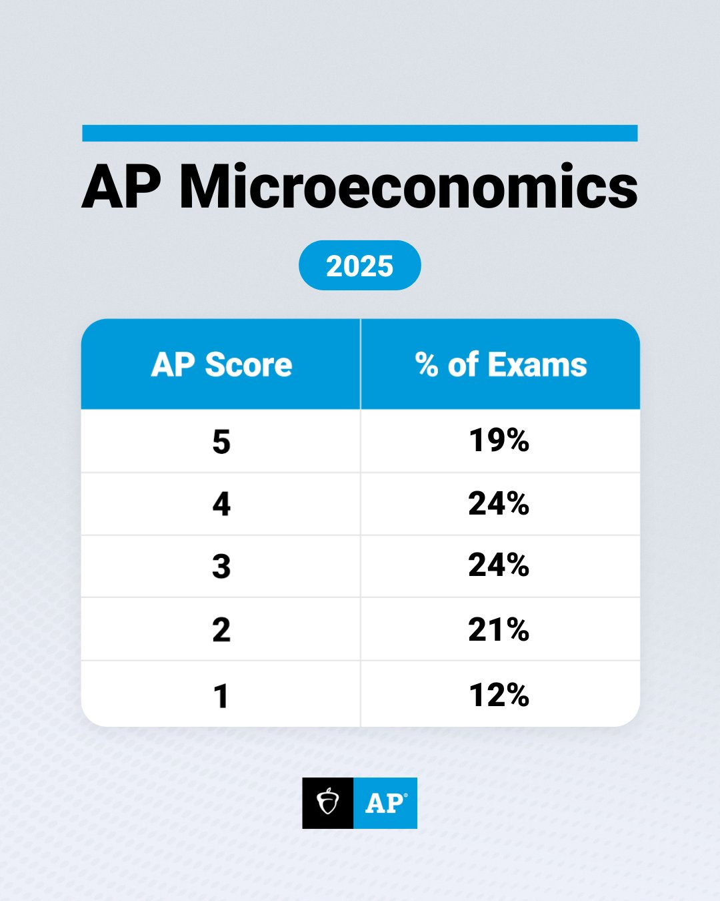

# What AP Microeconomics Covers and How It’s Tested

AP Microeconomics is often described as one of the more accessible AP exams, but “accessible” does not mean “easy.” In 2025, only 19% of global test-takers earned a 5. The course may feel intuitive because it deals with everyday decisions about prices, choices, and markets, but mastering it requires systematic understanding, not just casual familiarity.

## The Six Core Units of AP Microeconomics

The College Board structures the AP Microeconomics curriculum into six thematic units, each building on the last. Together, they mirror the core of a first-semester college-level microeconomics course.

| Unit | Topic | Exam Weight |
|------|-------|-------------|
| 1 | Basic Economic Concepts | 12–15% |
| 2 | Supply and Demand | 20–25% |
| 3 | Production, Cost, and Perfect Competition | 22–25% |
| 4 | Imperfect Competition | 15–22% |
| 5 | Factor Markets | 10–13% |
| 6 | Market Failure and Government Role | 8–13% |

**Unit 1: Basic Economic Concepts** introduces scarcity, opportunity cost, marginal analysis, and production possibilities. Though shared with AP Macroeconomics, these ideas are foundational—especially for interpreting graphs and making trade-off decisions. Questions here are typically straightforward multiple-choice items and should be considered “must-get” points.

**Unit 2: Supply and Demand** is the analytical engine of the course. Students learn to model how prices and quantities adjust in competitive markets, predict shifts due to external shocks (e.g., taxes, subsidies, income changes), and calculate surpluses. Mastery here is essential—it underpins nearly every subsequent topic.

**Unit 3: Production, Cost, and Perfect Competition** marks the turning point. This unit demands fluency in short-run vs. long-run cost curves, profit maximization (MR = MC), and the conditions for perfect competition. It’s dense with graphical analysis and conceptual distinctions (e.g., accounting vs. economic profit). Many students struggle here because the logic becomes more abstract and interconnected.

**Unit 4: Imperfect Competition** contrasts monopoly, oligopoly, and monopolistic competition against perfect competition. Success depends on comparative analysis—e.g., why monopolies restrict output, how game theory applies to oligopolies, or why monopolistically competitive firms earn zero economic profit in the long run. Creating comparison tables is highly recommended.

**Unit 5: Factor Markets** flips the script: now firms are buyers of labor, capital, and land, while households are sellers. The marginal revenue product (MRP) framework replaces consumer demand. This shift in perspective often trips students up, but the underlying supply-demand logic remains consistent.

**Unit 6: Market Failure and Government** covers externalities, public goods, asymmetric information, and government interventions (e.g., Pigouvian taxes, subsidies, regulation). While lower in weight, this unit tests conceptual clarity—especially on when and why markets fail to allocate efficiently.

## Exam Structure and Scoring

The AP Microeconomics exam lasts 2 hours and consists of two sections:

1. **Multiple-Choice Questions (MCQ)** – 60 questions, 70 minutes, 66% of total score  
   - Computer-based, five options per question  
   - Tests breadth of knowledge and quick application of models  
   - Time pressure is real; efficient pacing is critical

2. **Free-Response Questions (FRQ)** – 3 questions, 60 minutes, 33% of total score  
   - Typically includes one long question (8–10 points) and two short ones (4–6 points each)  
   - Requires concise, precise explanations—often just 1–3 sentences per part  
   - Heavy emphasis on graphing, labeling, and justifying economic reasoning

Scoring is generous relative to other APs:  
- ~80% of total points (≈72/90) typically yields a 5  
- ~65% usually secures a 4  

However, note that some universities require *both* Micro and Macro scores for economics credit. Always verify your target schools’ policies.

In sum, AP Microeconomics rewards structured thinking over rote memorization. The content is logical and cumulative, each unit scaffolds the next. Understanding *how* the exam tests this logic is the first step toward earning a top score.
